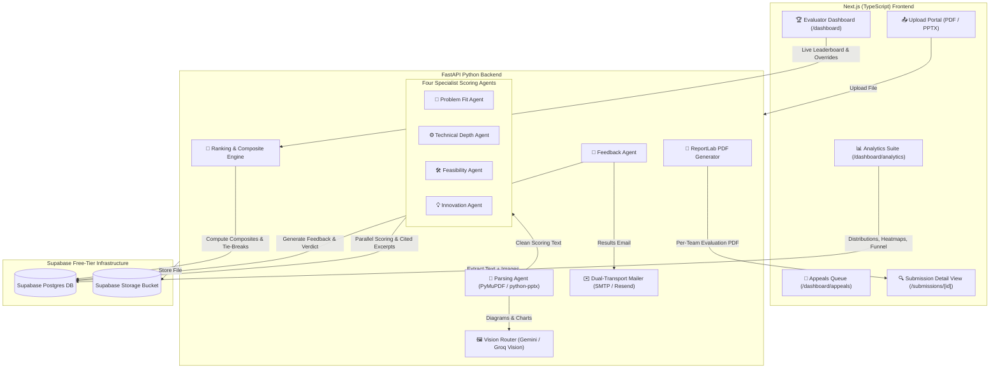

# JuryAI — Comprehensive Technical Project Explanation

> **Version:** 3.2.0  
> **Repository:** [github.com/sohanroy676/jury-ai](https://github.com/sohanroy676/jury-ai)  
> **Tech Stack:** Python (FastAPI), Next.js (TypeScript), Supabase (Postgres & Storage), Groq API, ReportLab  

---

## 1. Executive Summary & Mission Statement

### The Hackathon Judging Bottleneck
In modern hackathons—such as the **Smart India Hackathon (SIH)**, major university hackathons, and corporate innovation challenges—organizers face a critical scalability bottleneck: **evaluating dozens or hundreds of PDF pitch decks and PPTX slide presentations within tight timeframes**.

Manual evaluation suffers from:
1. **Evaluator Fatigue & Inconsistency**: Different judges score identical criteria (e.g., *Feasibility* or *Technical Depth*) on vastly different subjective scales.
2. **Superficial Reviewing**: Tight deadlines force judges to skim presentations, missing technical nuances or architecture diagrams.
3. **Lack of Explainability & Feedback**: Teams often receive numerical scores without actionable written feedback, justifications, or direct quotes explaining *why* they received a given score.
4. **Track & Domain Complexity**: Hackathons feature diverse tracks (e.g., AI/ML, Hardware, FinTech, Sustainability), each requiring different rubric weightings.

### The JuryAI Solution
**JuryAI** is an agentic, multi-agent AI evaluation system designed to automate hackathon submission parsing, specialist scoring, ranking, written feedback generation, explainability, manual overrides, and appeal management — **100% powered by free-tier APIs and open infrastructure**.

---

## 2. High-Level System Architecture & Workflow

JuryAI follows a decoupled **FastAPI backend** + **Next.js frontend** architecture. All data and storage persist in **Supabase Postgres & Object Storage**, while LLM inference is powered by **Groq API** (`llama-3.3-70b-versatile`).



---

## 3. End-to-End Submission Lifecycle

### Step 1: Upload & Pre-Submit Validation
- Teams submit proposals (`.pdf` or `.pptx`) through the Next.js upload portal.
- **Client-Side Validation**: File format, size limit (≤ 50MB), non-empty file, contact email formatting, and team name are validated inline before submission.
- **Re-Submission & Archival**: Duplicate uploads by the same team trigger a `409 Conflict` confirmation dialog ("Replace previous submission?"). Upon confirmation, the previous submission row is marked `superseded_at` in Postgres, maintaining complete version history while active queries filter only current submissions.

### Step 2: Text Parsing & Vision Processing
- **Document Text Extraction**: PyMuPDF handles `.pdf` documents while `python-pptx` processes `.pptx` slides, extracting raw text, slide titles, and speaker notes.
- **Visual Content Understanding**: Embedded images (architecture diagrams, flowcharts, schemas) are routed to a Vision Router powered by Gemini/Groq. Decorative/small images are ignored, while complex diagrams generate structured text descriptions merged directly into the document text for the scoring agents.

### Step 3: Multi-Agent Parallel Specialist Scoring
Instead of relying on a single general prompt, JuryAI splits scoring across **four independent specialist AI agents** running concurrently via Python's `asyncio.gather`:

1. **Problem Fit Agent**: Evaluates problem statement clarity, target audience alignment, real-world impact, and problem urgency.
2. **Technical Depth Agent**: Assesses system architecture, algorithm complexity, data flows, tech stack choices, and technical rigor solely from document content.
3. **Feasibility Agent**: Analyzes implementation viability, resource requirements, technical risk, deployment strategy, and timelines.
4. **Innovation Agent**: Evaluates novelty, uniqueness, creative differentiation, and competitive advantages over existing solutions.

#### Key Features of the Scoring Agents:
- **Fail-Closed Aggregation**: If any agent fails or returns malformed output, the entire scoring task fails closed rather than producing partial/misleading metrics.
- **Explainability (Cited Excerpts)**: Every specialist agent extracts direct quotes or section references (`cited_excerpt`) from the deck, ensuring scores are anchored in empirical evidence.

```json
{
  "criterion": "technical_depth",
  "score": 8,
  "justification": "The proposal details a multi-stage data ingestion pipeline using Kafka and PostgreSQL with sub-second latency targets.",
  "cited_excerpt": "\"Data is streamed via Kafka topics directly into Postgres with index optimization for sub-50ms query responses.\""
}
```

### Step 4: Track-Scoped Weighted Ranking Engine
Composite scores are computed dynamically on the fly based on track-specific rubric weights:

$$S_{\text{composite}} = \sum_{c \in \{\text{problem\_fit}, \text{technical\_depth}, \text{feasibility}, \text{innovation}\}} (w_c \cdot s_c)$$

Where $\sum w_c = 1.0$ (or $100\%$).

#### Deterministic Tie-Breaking Algorithm:
When two teams achieve identical composite scores, JuryAI eliminates arbitrary sorting by applying a strict, deterministic tie-breaking cascade:
1. **Primary**: Composite Score ($S_{\text{composite}}$)
2. **Secondary**: Innovation Score ($S_{\text{innovation}}$)
3. **Tertiary**: Submission ID Lexicographical Order ($\text{ID}_{\text{ASC}}$)
4. Teams with identical composite scores are automatically flagged with a **Tied Composite Badge** on the leaderboard.

### Step 5: Written Feedback Generation & Notification
- **Feedback Agent**: Analyzes the four criterion scores and justifications to generate structured written feedback:
  - **Key Strengths** (bullet points)
  - **Areas for Improvement / Weaknesses** (bullet points)
  - **One Actionable Next Step**
  - **Official Verdict** (`shortlist` vs `reject`)
- **Dual-Transport Notification System**:
  - Automatically dispatches confirmation emails on upload and evaluation results with written feedback once scored.
  - Supports **Gmail SMTP** (stdlib `smtplib` STARTTLS, zero extra dependencies) and **Resend API** (hand-rolled REST over pinned `httpx`).
  - **Graceful Failure Contract**: Mail errors log warnings and return status envelopes (`EmailResult`), ensuring mail transport hiccups never crash uploads or scoring workflows.

---

## 4. Key Platform Features & Modules

### 1. 🎛️ Multi-Track Scoping (`/dashboard/tracks`)
- Hackathons feature distinct tracks (e.g., *AI/ML*, *Hardware*, *Sustainability*).
- Organizers can create tracks, assign custom rubric weights (`PUT /api/rubrics/{trackId}`), and filter leaderboards, analytics, and exports per track.
- Evaluators switch tracks seamlessly via an **Active Track Selector** dropdown; choices are sticky across page refreshes via `sessionStorage`.

### 2. ✏️ Manual Score Overrides with Provenance
- Evaluators can override any individual AI score (`PUT /api/submissions/{id}/scores/{criterion}`).
- **Strict Governance**: Requires a minimum 10-character justification and evaluator name.
- **Audit Provenance**: The original AI score is preserved on the score record (`original_score`, `overridden_by`, `override_reason`), and the leaderboard instantly re-ranks in response.

### 3. 📊 Analytics Dashboard (`/dashboard/analytics`)
Provides macro-level competition insight across tracks:
- **Score Distribution Histograms**: Visualizing score distributions per criterion.
- **Criterion Heatmap**: Displaying team performance across criteria.
- **Submission Funnel**: Tracking progress through pipeline stages (*Submitted* $\to$ *Parsed* $\to$ *Scored* $\to$ *Shortlisted*).

### 4. 📩 Appeals System (`/dashboard/appeals`)
- After initial results are published, teams can submit formal appeals with justifications.
- Evaluators access a dedicated **Appeals Queue** containing the team's proposal, AI scores, written feedback, and appeal message.
- Evaluators approve or reject appeals with notes, automatically dispatching resolution emails to the team.

### 5. 📄 Export Suite (CSV & PDF Reports)
- **Leaderboard CSV Export**: Generates track-scoped CSV files with composite scores, criteria breakdown, and shortlist flags.
- **Per-Team PDF Evaluation Reports**: Built using ReportLab, generating professional PDF reports complete with team metadata, score progress bars, cited excerpts, and written feedback.

---

## 5. Technology Stack & Technical Choices

| Layer | Technology | Rationale |
|---|---|---|
| **Frontend Framework** | **Next.js 15 (TypeScript)** | React App Router for fast server rendering, client-side state management, and SEO optimization. |
| **Styling System** | **Vanilla CSS Dark Glassmorphism** | Premium dark mode, HSL tailored gradients, responsive grids, Google Fonts (`Outfit`, `Inter`, `JetBrains_Mono`). |
| **Backend API** | **FastAPI (Python)** | High-performance async ASGI web framework with Pydantic validation and automatic OpenAPI documentation. |
| **Database & Storage** | **Supabase (Postgres & Storage)** | Free-tier Postgres database with RLS support and Object Storage for PDF/PPTX assets. |
| **LLM Inference** | **Groq API (`llama-3.3-70b-versatile`)** | Sub-second Llama 3 inference on free-tier rate limits with structured JSON output. |
| **Vision Provider** | **Gemini / Groq Vision** | High-accuracy visual description of architecture diagrams and flowcharts. |
| **PDF Generation** | **ReportLab (Python)** | Programmatic PDF report rendering with custom typography and score bars. |
| **Testing & Quality** | **pytest** (Backend) & **Vitest** (Frontend) | 432 backend unit tests + 52 frontend tests ensuring 100% test pass rate and zero regressions. |

---

## 6. Database Schema Architecture

JuryAI relies on 7 core Postgres tables in Supabase:

1. `submissions`: Stores submission metadata (`id`, `team_name`, `team_email`, `file_path`, `file_type`, `hackathon_id`, `superseded_at`, `uploaded_at`).
2. `parsed_submissions`: Stores extracted raw document text, slide titles, speaker notes, and image descriptions.
3. `scores`: Stores criterion scores (`submission_id`, `criterion`, `score`, `justification`, `cited_excerpt`, `agent_version`, `hackathon_id`, `original_score`, `overridden_by`, `override_reason`).
4. `rubric_config`: Stores track-scoped criterion weights (`hackathon_id`, `problem_fit`, `technical_depth`, `feasibility`, `innovation`).
5. `feedback`: Stores generated written feedback (`submission_id`, `strengths`, `weaknesses`, `suggestion`, `verdict`, `agent_version`).
6. `appeals`: Stores team appeals and evaluator resolutions (`submission_id`, `appellant_email`, `reason`, `status`, `evaluator_notes`, `resolved_at`).
7. `tracks`: Stores hackathon track definitions (`id`, `name`, `description`, `created_at`).

---

## 7. 100% Free-Tier Engineering Philosophy

JuryAI is built from the ground up to operate with zero paid cloud dependencies:
- **Groq Free-Tier Rate Limits**: Batch scoring processes submissions sequentially one by one while running four scoring agents in parallel per submission, staying within Groq's RPM/TPM free limits.
- **Supabase Free Tier**: Uses standard Supabase Postgres and S3 storage with indexed queries.
- **Native Transports**: Standard library `smtplib` handles email delivery without requiring paid email SaaS platforms.
- **Lightweight Dependencies**: Uses pure Python utilities and thin HTTP wrappers over pinned libraries, avoiding dependency version conflicts.

---

## 8. Summary

JuryAI transforms hackathon evaluation from a stressful, error-prone manual chore into a **fast, transparent, explainable, and multi-track automated AI workflow**. With multi-agent scoring, cited excerpts, track scoping, manual evaluator overrides, appeal management, and zero-cost operation, JuryAI delivers enterprise-grade hackathon judging for organizers everywhere.
